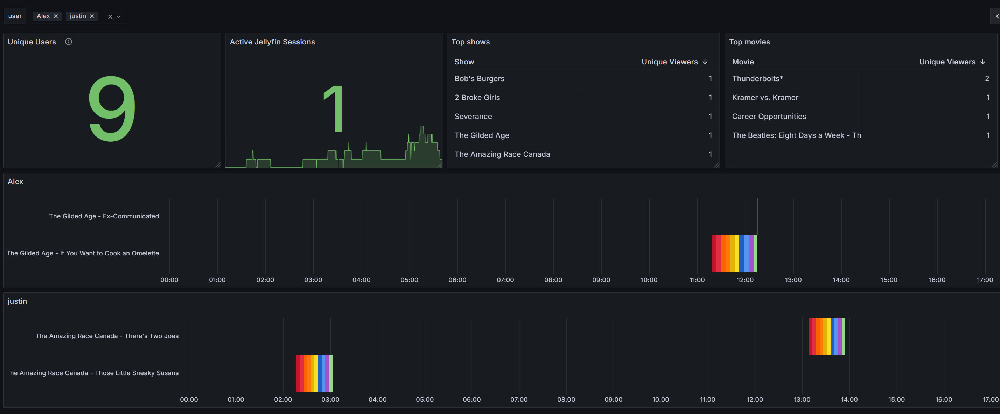

# Jellyfin Session Exporter

A Prometheus exporter that monitors Jellyfin media server activity by exposing metrics about active playback sessions, including session counts and playback progress.

## 🚀 Features

- Real-time monitoring of active Jellyfin sessions
- Progress tracking for individual playback sessions
- Total active session count
- Cumulative session tracking
- Built-in health checks for container orchestration
- Lightweight Python implementation

## � Configuration

The exporter requires two environment variables to be set:

| Variable | Description | Default |
|----------|-------------|---------|
| `JELLYFIN_URL` | The base URL of your Jellyfin server | `http://localhost:8096` |
| `JELLYFIN_API_KEY` | Your Jellyfin API key | Required |

To get an API key:
1. Log into your Jellyfin server as an administrator
2. Go to Dashboard → API Keys
3. Create a new API key

## �📆 Docker Usage

Pull and run the latest version:

```bash
docker run -d \
  --name jellyfin-exporter \
  -p 9789:9789 \
  -e JELLYFIN_URL=http://your-jellyfin:8096 \
  -e JELLYFIN_API_KEY=your_api_key \
  ajwest3d/jellyfin-session-exporter:1.0.0
```

Or build locally:

```bash
# Build the image
docker build -t jellyfin-session-exporter .

# Run with environment variables
docker run -d \
  --name jellyfin-exporter \
  -p 9789:9789 \
  -e JELLYFIN_URL=http://your-jellyfin:8096 \
  -e JELLYFIN_API_KEY=your_api_key \
  jellyfin-session-exporter
```

The exporter will be available at `http://localhost:9789/metrics`

## 🔧 Prometheus Scrape Config

```yaml
- job_name: 'jellyfin_sessions'
  static_configs:
    - targets: ['your-host:9789']
```

## 📊 Metrics

The following metrics are exposed at `/metrics`:

| Metric Name | Type | Description | Labels |
|------------|------|-------------|---------|
| `jellyfin_playback_progress_percent` | Gauge | Progress percentage of each active playback session | `user`, `item_name`, `session_id` |
| `jellyfin_active_sessions_total` | Gauge | Total number of currently active playback sessions | none |
| `jellyfin_active_sessions_count_total` | Gauge | Cumulative count of all sessions seen since exporter start | none |

### Grafana
Import the [Grafana dashboard example](grafana/grafana_dashboard.json) json.



## 🔍 Health Checking

The container includes a built-in health check that verifies the `/metrics` endpoint is responding correctly. The health check runs every 30 seconds with a 3-second timeout.

## 🚦 Port

The exporter listens on port `9789` by default.

## 📝 License

MIT License

## 👥 Contributing

Contributions are welcome! Please feel free to submit a Pull Request.
